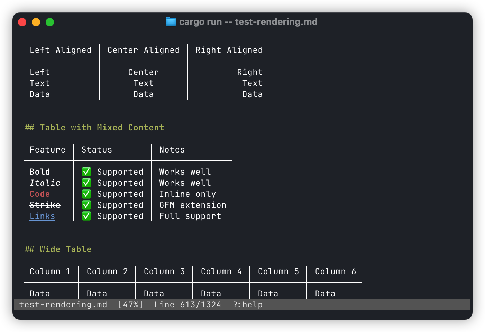

# Markless

Markless is a terminal markdown viewer with image support. It is focused on fast navigation, clear rendering, and sensible defaults for long documents.

## Screenshots




## Features

- Markdown rendering with headings, lists, tables, block quotes, code blocks, and footnotes
- Syntax-highlighted code blocks with lazy highlighting for performance
- Inline images (Kitty, Sixel, iTerm2, and half-block fallback)
- Directory browse mode with file preview
- Table of contents sidebar with keyboard and mouse support
- Search with match navigation and highlight
- File watching for live reload
- Link hover and click (including image placeholders)
- Line selection with mouse drag and copy
- Fast scrolling with stable layout and reflow on resize

## Installation

### Development (from source)

```bash
cargo install --path .
```

### Production (from crates.io)

```bash
cargo install markless
```

## Usage

```bash
markless README.md          # View a file
markless .                  # Browse current directory
markless                    # Browse current directory (default)
markless src/               # Browse a directory
```

When given a directory, markless opens in browse mode: the sidebar shows the file listing and the first markdown file (or first file) is previewed automatically. Navigate with arrow keys, press Enter to open, and Backspace to go to the parent directory.

## Command Line Options

- `--watch`  Auto-reload on file changes
- `--no-toc`  Hide the table of contents sidebar
- `--toc`  Start with TOC visible
- `--no-images`  Disable inline image rendering (show placeholders only)
- `--force-half-cell`  Force half-cell image rendering (debug)
- `--theme <auto|light|dark>`  Force highlight theme background
- `--perf`  Enable startup performance logging
- `--render-debug-log <PATH>`  Write render/image debug events to a file
- `--save`  Save current flags as defaults in the global config
- `--clear`  Clear saved defaults in the global config

Config files:
- Global (macOS): `~/Library/Application Support/markless/config`
- Local override: `.marklessrc` in the current directory

## Key Bindings

Navigation
- `j` / `k` or arrows: scroll
- `Space` / `PageDown`: page down
- `b` / `PageUp`: page up
- `Ctrl-d` / `Ctrl-u`: half page
- `g` / `G`: top / bottom

Search
- `/`: start search
- `Enter`: next match
- `Esc`: clear search

TOC
- `t`: toggle TOC
- `T`: toggle + focus TOC
- `Tab`: switch focus
- `j` / `k`, arrows, `Enter` / `Space`: navigate + jump

Browse
- `B`: enter directory browse mode
- `F`: return to file-only mode (heading TOC)
- `Backspace`: navigate to parent directory (in TOC)

Other
- `w`: toggle watch
- `r` / `R`: reload file
- `o`: open visible links (1-9)
- `?` / `F1`: toggle help
- `q` / `Ctrl-c`: quit

Mouse
- Scroll wheel: scroll
- Click links or images: open
- Hover link/image: show URL
- Click + drag: select lines and copy

## License

MIT
