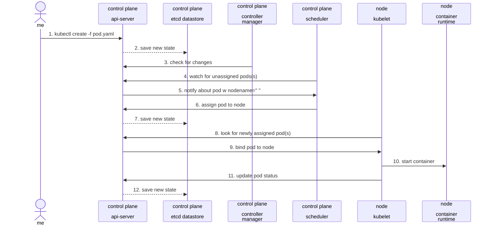
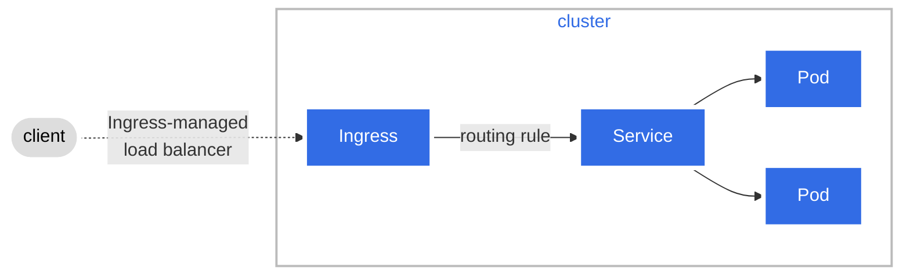
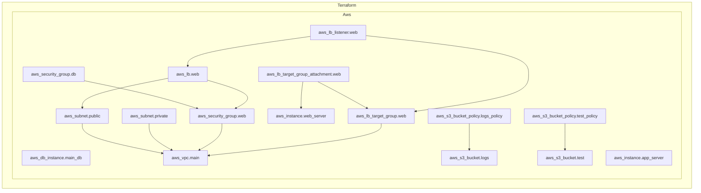
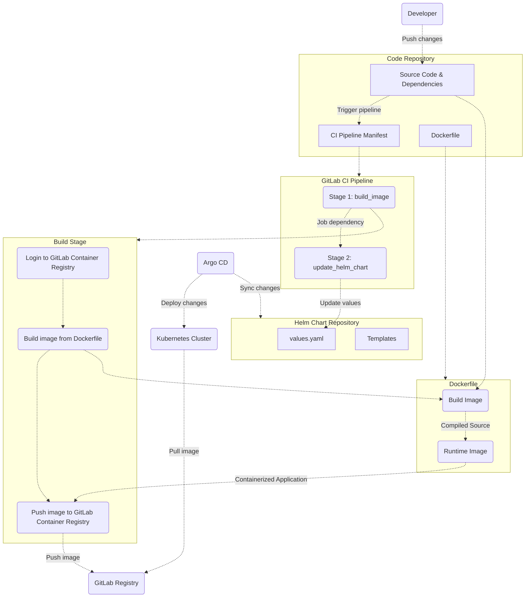
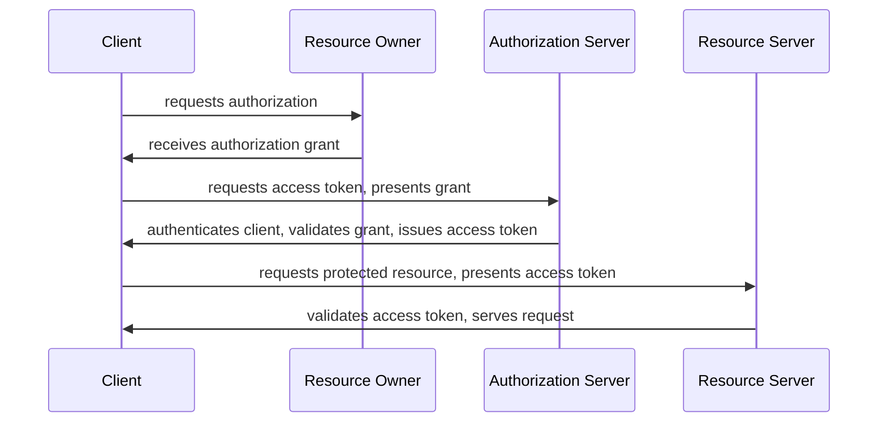
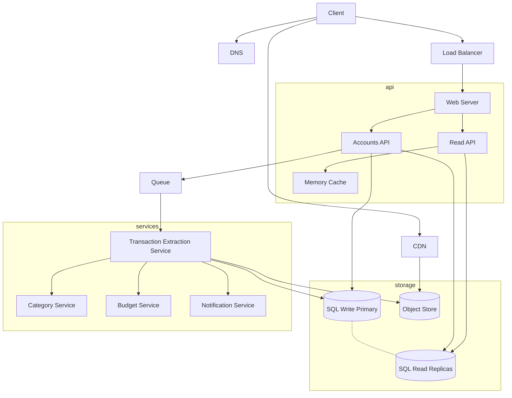
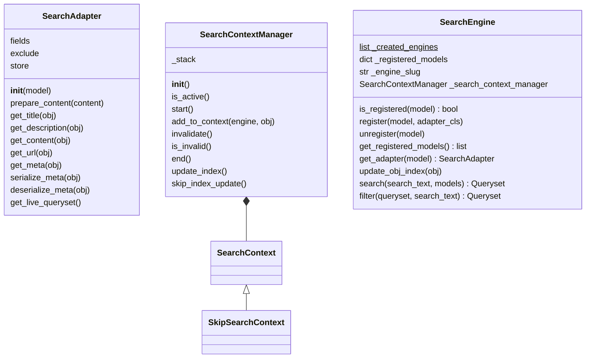
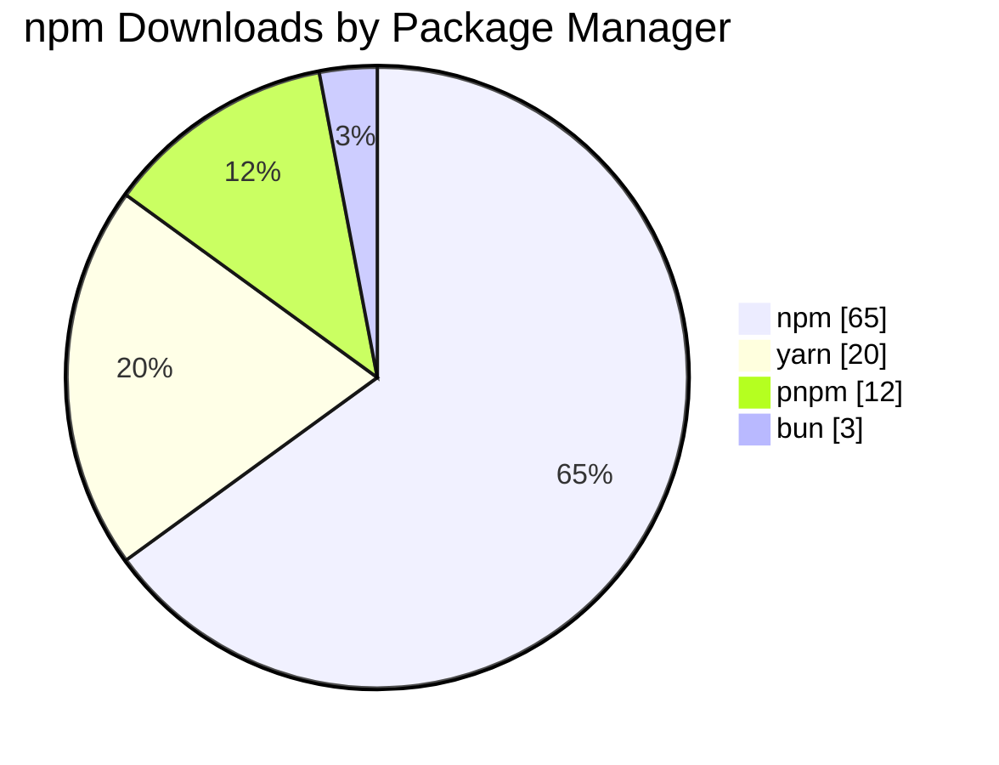
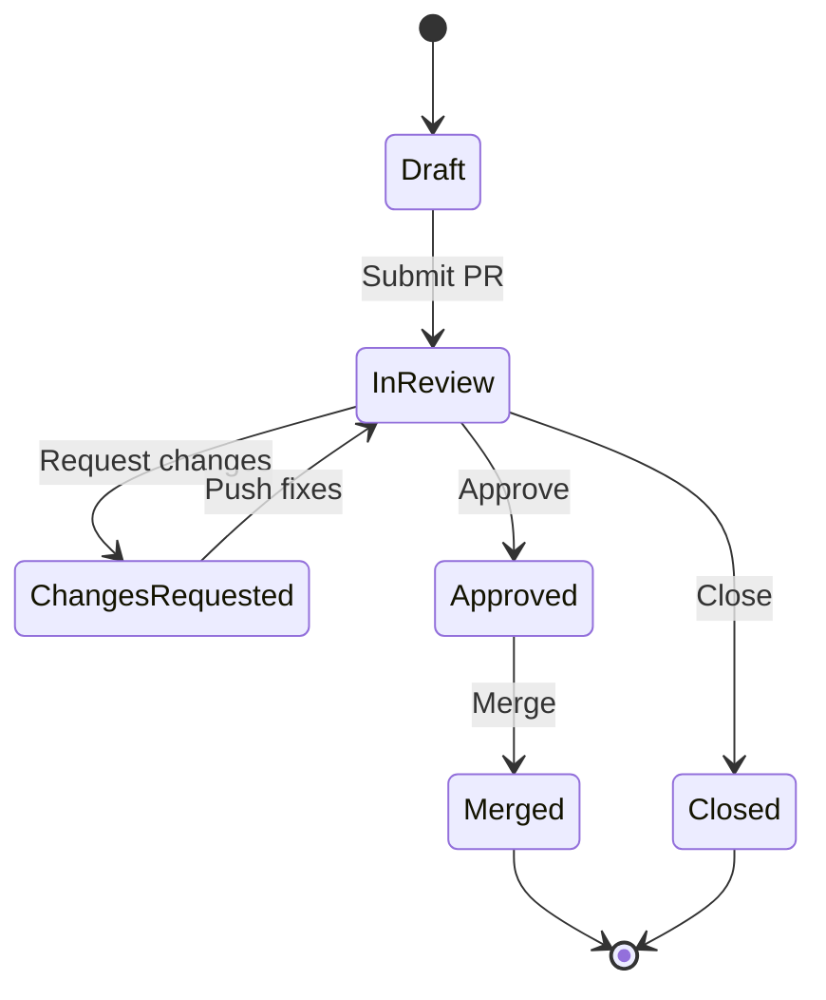
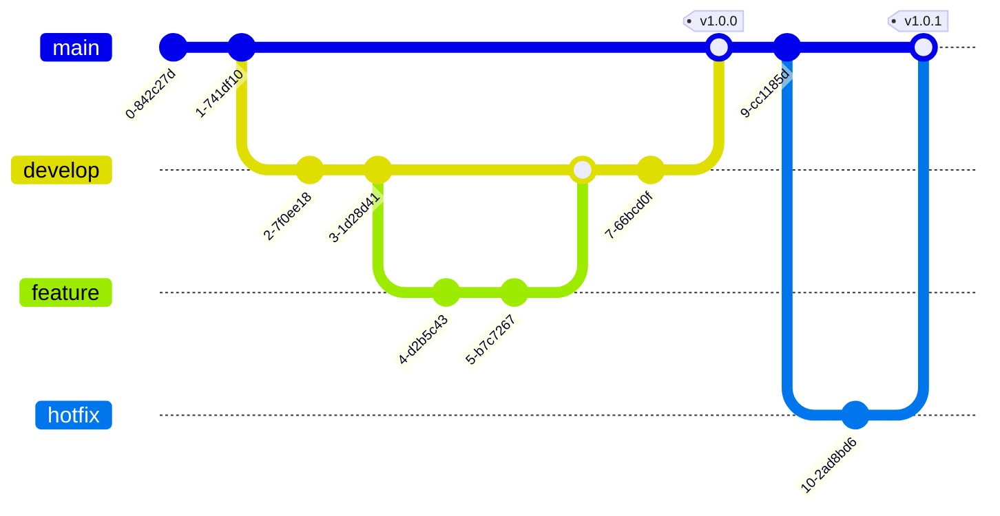

# Mermaid Diagrams

Real-world mermaid diagrams from open source projects and documentation.

## Kubernetes Pod Creation

From the [Kubernetes contributors blog](https://www.kubernetes.dev/blog/2021/12/01/improve-your-documentation-with-mermaid.js-diagrams/), showing the full lifecycle of creating a pod.

## Kubernetes Ingress

From the [Kubernetes official docs](https://kubernetes.io/docs/concepts/services-networking/ingress/), showing Ingress routing with custom styling.

## Terraform AWS Infrastructure

From [RoseSecurity/Terramaid](https://github.com/RoseSecurity/Terramaid), auto-generated from Terraform files showing real AWS resource dependencies.

## GitLab CI/CD with ArgoCD Pipeline

From a [production deployment guide](https://blog.jklug.work/posts/argocd-gitlab-pt1/), showing the full flow from developer push through CI to Kubernetes.

## OAuth 2.0 Authorization Flow

Standard OAuth 2.0 authorization code grant, from a widely-referenced [gist](https://gist.github.com/cseeman/cf1a0cf7d931794d78f570e9f413f4a1).

## Scaled System Architecture

From [rudolfolah/mermaid-diagram-examples](https://github.com/rudolfolah/mermaid-diagram-examples), a financial aggregation app architecture showing DNS, CDN, load balancing, API layer, message queues, microservices, and storage tiers.

## Django Watson Class Diagram

From [rudolfolah/mermaid-diagram-examples](https://github.com/rudolfolah/mermaid-diagram-examples), documenting the real architecture of the `django-watson` full-text search library.

## Pie Chart

## State Diagram

## Git Graph

