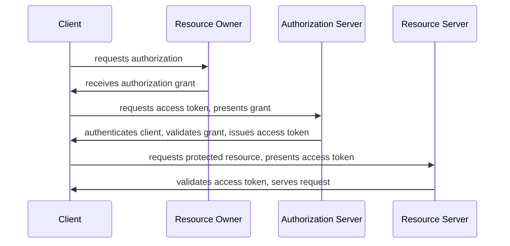

# Heading Level 1

## Heading Level 2

### Heading Level 3

#### Heading Level 4

##### Heading Level 5

###### Heading Level 6

# Heading with `inline code`

## Heading with *emphasis* and **strong**

### Heading with [link](https://example.com)

Alternate Heading Style 1
=========================

Alternate Heading Style 2
-------------------------


---


# Paragraphs and Emphasis

This is a regular paragraph with some text. It can span multiple lines
and will be wrapped according to the terminal width.

This is another paragraph separated by a blank line.

## Emphasis Styles

*This text is italicized with asterisks*

_This text is italicized with underscores_

**This text is bold with asterisks**

__This text is bold with underscores__

***This text is bold and italic***

___This text is also bold and italic___

**This is bold with _nested italic_ inside**

*This is italic with **nested bold** inside*

## Strikethrough (GFM Extension)

~~This text has been struck through~~

This sentence has ~~deleted~~ text in the middle.

~~**Bold strikethrough**~~ and ~~*italic strikethrough*~~

## Inline Code

Use the `printf()` function to print output.

Type `npm install` to install dependencies.

The `--verbose` flag enables detailed output.

Escape backticks with double backticks: ``code with ` backtick``


---


# Lists

## Unordered Lists

* Item one
* Item two
* Item three

- Item using dash
- Another item
- Third item

+ Item using plus
+ Another item
+ Third item

## Ordered Lists

1. First item
2. Second item
3. Third item

1. All items
1. Can use
1. The same number

## Ordered Lists With Two-Digit Alignment

9. Ninth item
10. Tenth item
11. Eleventh item

## Nested Lists

* Level 1 item
  * Level 2 item
    * Level 3 item
    * Another level 3
  * Back to level 2
* Back to level 1

1. First ordered
   1. Nested ordered
   2. Another nested
2. Second ordered
   * Mixed with unordered
   * Another unordered
3. Third ordered

## Lists with Paragraphs

* First item with a longer description that might
  wrap to multiple lines in the source.

  This is a continuation paragraph under the same list item.

* Second item

* Third item with `inline code` and **bold text**

## Ordered Lists with Wrapping

1. This is a long ordered list item that should wrap onto the next line while
   keeping the hanging indent aligned with the text.
2. A shorter item.

## Nested Lists

- Parent item
  - Child item
    - Grandchild item
- Another parent

## List Item with Multiple Paragraphs

- First paragraph in a list item.

  Second paragraph in the same list item should be separated by a blank line.

## Task Lists (GFM Extension)

- [x] Completed task
- [x] Another completed task
- [ ] Incomplete task
- [ ] Another incomplete task

### Nested Task Lists

- [x] Main task completed
  - [x] Subtask 1 done
  - [x] Subtask 2 done
  - [ ] Subtask 3 pending
- [ ] Main task incomplete
  - [ ] All subtasks pending
  - [ ] Another subtask

#### Deeply Nested Task Lists

- [x] Level 1
  - [ ] Level 2
    - [x] Level 3


---


# Code Blocks

## Indented Code Block

    This is a code block
    created with indentation
    (4 spaces or 1 tab)

## Fenced Code Blocks

```
Plain fenced code block
without language specification
```

### Rust

```rust
fn main() {
    let greeting = "Hello, World!";
    println!("{}", greeting);

    let numbers: Vec<i32> = (1..=10).collect();
    let sum: i32 = numbers.iter().sum();
    println!("Sum: {}", sum);
}

#[derive(Debug)]
struct Point {
    x: f64,
    y: f64,
}

impl Point {
    fn new(x: f64, y: f64) -> Self {
        Self { x, y }
    }

    fn distance(&self, other: &Point) -> f64 {
        ((self.x - other.x).powi(2) + (self.y - other.y).powi(2)).sqrt()
    }
}
```

### Python

```python
def fibonacci(n: int) -> list[int]:
    """Generate Fibonacci sequence up to n terms."""
    if n <= 0:
        return []
    elif n == 1:
        return [0]

    sequence = [0, 1]
    while len(sequence) < n:
        sequence.append(sequence[-1] + sequence[-2])
    return sequence

# Usage
fib = fibonacci(10)
print(f"First 10 Fibonacci numbers: {fib}")

class Calculator:
    def __init__(self):
        self.result = 0

    def add(self, value):
        self.result += value
        return self
```

### JavaScript

```javascript
const fetchData = async (url) => {
  try {
    const response = await fetch(url);
    if (!response.ok) {
      throw new Error(`HTTP error! status: ${response.status}`);
    }
    const data = await response.json();
    return data;
  } catch (error) {
    console.error('Fetch error:', error);
    throw error;
  }
};

class EventEmitter {
  constructor() {
    this.events = {};
  }

  on(event, callback) {
    if (!this.events[event]) {
      this.events[event] = [];
    }
    this.events[event].push(callback);
  }

  emit(event, ...args) {
    if (this.events[event]) {
      this.events[event].forEach(cb => cb(...args));
    }
  }
}
```

### Go

```go
package main

import (
    "fmt"
    "sync"
)

func worker(id int, jobs <-chan int, results chan<- int, wg *sync.WaitGroup) {
    defer wg.Done()
    for job := range jobs {
        fmt.Printf("Worker %d processing job %d\n", id, job)
        results <- job * 2
    }
}

func main() {
    jobs := make(chan int, 100)
    results := make(chan int, 100)
    var wg sync.WaitGroup

    for w := 1; w <= 3; w++ {
        wg.Add(1)
        go worker(w, jobs, results, &wg)
    }

    for j := 1; j <= 9; j++ {
        jobs <- j
    }
    close(jobs)

    wg.Wait()
    close(results)
}
```

### Shell/Bash

```bash
#!/bin/bash

# Script to backup files
BACKUP_DIR="/backup/$(date +%Y%m%d)"
SOURCE_DIR="/data"

mkdir -p "$BACKUP_DIR"

for file in "$SOURCE_DIR"/*; do
    if [ -f "$file" ]; then
        cp "$file" "$BACKUP_DIR/"
        echo "Backed up: $file"
    fi
done

echo "Backup complete: $(ls -1 "$BACKUP_DIR" | wc -l) files"
```

### SQL

```sql
SELECT
    u.id,
    u.username,
    COUNT(o.id) AS order_count,
    SUM(o.total) AS total_spent
FROM users u
LEFT JOIN orders o ON u.id = o.user_id
WHERE u.created_at >= '2024-01-01'
GROUP BY u.id, u.username
HAVING COUNT(o.id) > 5
ORDER BY total_spent DESC
LIMIT 10;
```

### JSON

```json
{
  "name": "markless",
  "version": "0.1.0",
  "dependencies": {
    "ratatui": "0.30",
    "comrak": "0.31",
    "syntect": "5"
  },
  "features": {
    "images": true,
    "syntax_highlighting": true,
    "file_watching": true
  }
}
```

### YAML

```yaml
version: '3.8'
services:
  web:
    image: nginx:alpine
    ports:
      - "8080:80"
    volumes:
      - ./html:/usr/share/nginx/html:ro
    environment:
      - NGINX_HOST=example.com
      - NGINX_PORT=80
    depends_on:
      - api

  api:
    build: ./api
    ports:
      - "3000:3000"
    env_file:
      - .env
```

### TOML

```toml
[package]
name = "markless"
version = "0.1.0"
edition = "2021"

[dependencies]
ratatui = "0.30"
comrak = "0.31"
syntect = "5"
tokio = { version = "1", features = ["full"] }

[dev-dependencies]
insta = "1"
proptest = "1"
```


---


# Block Quotes

## Simple Block Quote

> This is a block quote. It can contain multiple sentences
> and span multiple lines in the source file.

## Multi-Paragraph Block Quote

> This is the first paragraph in a block quote.
>
> This is the second paragraph. Notice the blank line with
> just a `>` character between them.

## Nested Block Quotes

> This is the first level of quoting.
>
> > This is a nested block quote.
> > It can also span multiple lines.
>
> Back to the first level.

> > > Triple nested quote for emphasis.

## Block Quotes with Other Elements

> ## Heading Inside a Quote
>
> This quote contains various elements:
>
> - A list item
> - Another list item
> - Third item
>
> And some `inline code` with **bold** and *italic* text.
>
> ```rust
> fn quoted_code() {
>     println!("Code in a quote!");
> }
> ```

## Attribution Style

> "The only way to do great work is to love what you do."
>
> — Steve Jobs

> "Any sufficiently advanced technology is indistinguishable from magic."
>
> — Arthur C. Clarke

## Lazy Block Quotes

> This is a lazy block quote where only the first line
has the > character. The subsequent lines are still
part of the same quote until a blank line.

## Long Quote

> Lorem ipsum dolor sit amet, consectetur adipiscing elit. Sed do
> eiusmod tempor incididunt ut labore et dolore magna aliqua. Ut enim
> ad minim veniam, quis nostrud exercitation ullamco laboris nisi ut
> aliquip ex ea commodo consequat. Duis aute irure dolor in
> reprehenderit in voluptate velit esse cillum dolore eu fugiat nulla
> pariatur. Excepteur sint occaecat cupidatat non proident, sunt in
> culpa qui officia deserunt mollit anim id est laborum.


---


# Links and Images

## Inline Links

[Visit GitHub](https://github.com)

[Link with title](https://example.com "Example Website")

This sentence has [a link](https://example.com) in the middle.

## Reference Links

[GitHub][github-link]
[Rust Programming Language][rust]
[Example][]

[github-link]: https://github.com
[rust]: https://www.rust-lang.org "Rust Homepage"
[Example]: https://example.com

## Autolinks (GFM Extension)

Visit https://github.com for code hosting.

Send email to user@example.com for support.

Check out www.example.com for more info.

## URLs in Angle Brackets

<https://github.com>

<user@example.com>

## Links with Formatting

[**Bold link text**](https://example.com)

[*Italic link text*](https://example.com)

[`Code link text`](https://example.com)

[Link with ~~strikethrough~~](https://example.com)

## Images


## Reference Style Images

![Icon][icon-image]

[icon-image]: icon.png "Small Icon"

## Wide Banner Image


## Portrait Image


## Inline Image in Paragraph

Here is some text with an inline image  embedded in the middle of a sentence.

## Multiple Images

  


---


# Tables (GFM Extension)

## Simple Table

| Name | Age | City |
|------|-----|------|
| Alice | 30 | New York |
| Bob | 25 | Los Angeles |
| Carol | 35 | Chicago |

## Table with Alignment

| Left Aligned | Center Aligned | Right Aligned |
|:-------------|:--------------:|--------------:|
| Left | Center | Right |
| Text | Text | Text |
| Data | Data | Data |

## Table with Mixed Content

| Feature | Status | Notes |
|---------|--------|-------|
| **Bold** | ✅ Supported | Works well |
| *Italic* | ✅ Supported | Works well |
| `Code` | ✅ Supported | Inline only |
| ~~Strike~~ | ✅ Supported | GFM extension |
| [Links](/) | ✅ Supported | Full support |

## Wide Table

| Column 1 | Column 2 | Column 3 | Column 4 | Column 5 | Column 6 |
|----------|----------|----------|----------|----------|----------|
| Data | Data | Data | Data | Data | Data |
| More | More | More | More | More | More |
| Values | Values | Values | Values | Values | Values |

## Table with Long Content

| Key | Description |
|-----|-------------|
| `api_key` | The API key used for authentication with the service |
| `timeout_ms` | Maximum time to wait for a response in milliseconds |
| `retry_count` | Number of times to retry failed requests |
| `base_url` | The base URL for all API endpoints |

## Programming Languages Comparison

| Language | Typing | Paradigm | Memory Management |
|----------|--------|----------|-------------------|
| Rust | Static | Multi | Ownership |
| Python | Dynamic | Multi | Garbage Collected |
| Go | Static | Procedural | Garbage Collected |
| C | Static | Procedural | Manual |
| JavaScript | Dynamic | Multi | Garbage Collected |

## Table with Numbers

| Item | Quantity | Price | Total |
|------|----------|-------|-------|
| Apples | 5 | $1.50 | $7.50 |
| Oranges | 3 | $2.00 | $6.00 |
| Bananas | 7 | $0.75 | $5.25 |
| **Total** | **15** | | **$18.75** |

## Minimal Table

| A | B |
|---|---|
| 1 | 2 |


---


# Horizontal Rules

Content above the rule.

---

Content between rules.

***

Content between rules.

___

Content between rules.

- - -

Content between rules.

* * *

Content below the last rule.

## Horizontal Rules in Context

### Section One

Some introductory content for the first section.

---

### Section Two

The rule above provides visual separation between sections.

---

### Section Three

Each section is clearly delineated.


---


# Footnotes (Extension)

## Basic Footnotes

Here is a sentence with a footnote[^123].

Another sentence with a different footnote[^2].

[^1]: This is the first footnote.
[^2]: This is the second footnote.

## Inline Footnotes

This is a paragraph with an inline footnote^[This footnote is defined inline rather than at the bottom].

## Named Footnotes

According to the documentation[^docs], this feature is supported.

See the specification[^spec] for more details.

[^docs]: The official documentation can be found at example.com/docs
[^spec]: RFC 7231 - Hypertext Transfer Protocol (HTTP/1.1)

## Multi-paragraph Footnotes

Here's a complex footnote reference[^complex].

[^complex]: This footnote has multiple paragraphs.

    The second paragraph is indented to show it belongs
    to the same footnote.

    - It can even contain
    - List items
    - Like this one

## Footnotes in Different Contexts

| Feature | Support | Note |
|---------|---------|------|
| Tables | Yes | Works with footnotes[^table] |
| Lists | Yes | Also supported |

[^table]: Footnotes work inside table cells.

> Block quotes can also have footnotes[^quote].

[^quote]: This footnote is referenced from within a block quote.

## Superscript (Extension)

E = mc^2^

Water is H~2~O (subscript may not be supported)

2^10^ = 1024

x^2^ + y^2^ = z^2^


---


# Complex Nesting and Edge Cases

## Deeply Nested Lists

1. First level
   1. Second level
      1. Third level
         1. Fourth level
            1. Fifth level
         2. Back to fourth
      2. Back to third
   2. Back to second
2. Back to first

## Mixed Nested Content

* List item with a block quote:

  > This quote is inside a list item.
  > It can span multiple lines.

* List item with code:

  ```rust
  fn nested_in_list() {
      println!("Code inside list");
  }
  ```

* List item with a table:

  | Col A | Col B |
  |-------|-------|
  | Data | Data |

## Block Quote with Everything

> # Heading in Quote
>
> Regular paragraph in quote.
>
> * List in quote
> * Another item
>   * Nested in quote
>
> ```python
> def code_in_quote():
>     pass
> ```
>
> | Table | In | Quote |
> |-------|-----|-------|
> | A | B | C |
>
> > Nested quote
> > > Double nested quote

## Adjacent Elements

**Bold text immediately followed by:**
*Italic text immediately followed by:*
`inline code immediately followed by:`
~~strikethrough~~

---

Text right after horizontal rule.

```
Code right after horizontal rule
```

---

> Quote right after horizontal rule

## Long Lines and Wrapping

This is an extremely long line that should test how the terminal handles text wrapping when the content exceeds the available width of the display and needs to flow onto multiple visual lines while still being considered a single paragraph in the markdown source.

## Special Characters

| Character | Name | Example |
|-----------|------|---------|
| & | Ampersand | Tom & Jerry |
| < | Less than | 5 < 10 |
| > | Greater than | 10 > 5 |
| " | Quote | She said "hello" |
| ' | Apostrophe | It's working |
| \| | Pipe | Column \| Data |
| \\ | Backslash | C:\\Users |
| \* | Asterisk | 5 \* 3 = 15 |
| \_ | Underscore | file\_name |
| \` | Backtick | \`code\` |

## Unicode Content

### Emojis

🚀 Rocket launch!
📝 Taking notes
✅ Task complete
❌ Task failed
⚠️ Warning
💡 Idea
🔧 Tool
📊 Chart

### International Text

**Chinese:** 你好世界
**Japanese:** こんにちは世界
**Korean:** 안녕하세요 세계
**Russian:** Привет мир
**Arabic:** مرحبا بالعالم
**Greek:** Γειά σου Κόσμε

### Math Symbols

∀x ∈ ℝ: x² ≥ 0
∑(i=1 to n) i = n(n+1)/2
∫₀^∞ e^(-x²) dx = √π/2
∂f/∂x = lim(h→0) [f(x+h) - f(x)]/h

## Empty Elements

### Empty List Items

*
* Item with content
*
* Another item

### Minimal Content

#

##

*a*

**b**

`c`


---


# Description Lists (Extension)

## Basic Description List

Term 1
: Definition for term 1

Term 2
: Definition for term 2

Term 3
: Definition for term 3

## Multiple Definitions

Apple
: A red or green fruit
: A technology company

Orange
: A citrus fruit
: A color between red and yellow

## Long Definitions

Markdown
: A lightweight markup language that you can use to add formatting
  elements to plaintext text documents. Created by John Gruber in 2004,
  Markdown is now one of the world's most popular markup languages.

Rust
: A systems programming language focused on safety, speed, and
  concurrency. It achieves memory safety without garbage collection
  through its ownership system.

## Definitions with Formatting

**API**
: An *Application Programming Interface* is a set of functions and
  procedures allowing the creation of applications that access the
  features or data of an operating system, application, or other service.

**CLI**
: A `Command Line Interface` is a text-based interface used to interact
  with software and operating systems by typing commands.

## Nested Content in Definitions

Configuration
: The settings for an application:

  - Database connection strings
  - API keys
  - Feature flags

  Example configuration:

  ```yaml
  database:
    host: localhost
    port: 5432
  ```


---


# Markless - Terminal Markdown Viewer

[]()
[]()
[]()

A fast, feature-rich terminal-based markdown viewer with image support.

## Features

- **Full CommonMark Support** - Headings, lists, code blocks, and more
- **GFM Extensions** - Tables, task lists, strikethrough, autolinks
- **Image Rendering** - Kitty, Sixel, iTerm2, and halfblock protocols
- **Syntax Highlighting** - 100+ languages via syntect
- **Table of Contents** - Navigate large documents easily
- **Live Reload** - Watch files for changes
- **Keyboard Navigation** - Vim-like keybindings

## Installation

### From Cargo

```bash
cargo install markless
```

### From Source

```bash
git clone https://github.com/example/markless
cd markless
cargo build --release
```

## Quick Start

```bash
# View a markdown file
markless README.md

# Enable file watching
markless --watch document.md

# Show table of contents
markless --toc notes.md
```

## Keyboard Shortcuts

| Key | Action |
|-----|--------|
| `j` / `↓` | Scroll down |
| `k` / `↑` | Scroll up |
| `d` | Half page down |
| `u` | Half page up |
| `g` | Go to top |
| `G` | Go to bottom |
| `t` | Toggle TOC |
| `/` | Search |
| `n` | Next match |
| `N` | Previous match |
| `q` | Quit |

## Configuration

Create `~/.config/markless/config.toml`:

```toml
[display]
theme = "dracula"
show_line_numbers = true
wrap_mode = "word"

[keys]
scroll_amount = 3
```

## Requirements

- Rust 1.75 or later
- A terminal with:
  - [x] 256 color support
  - [x] Unicode support
  - [ ] Image protocol support (optional)

## Contributing

1. Fork the repository
2. Create a feature branch (`git checkout -b feature/amazing`)
3. Make your changes
4. Run tests (`cargo test`)
5. Submit a pull request

See [CONTRIBUTING.md](CONTRIBUTING.md) for detailed guidelines.

## License

This project is licensed under the MIT License - see the [LICENSE](LICENSE) file for details.

---

Made with ❤️ by the Markless team


---


# Markdown Syntax Edge Cases

## Escaping Special Characters

\*Not italic\*

\**Not bold\**

\# Not a heading

\- Not a list item

\`Not code\`

\[Not a link\](url)

\> Not a blockquote

## Code Block Edge Cases

### Empty Code Block

```
```

### Code Block with Only Whitespace

```


```

### Code Block with Backticks Inside

```markdown
Here is some `inline code` in a code block.
And a fenced block inside:
~~~
nested?
~~~
```

### Very Long Lines in Code

```
This is a very long line of code that exceeds the typical terminal width and should test how the viewer handles horizontal overflow in code blocks without wrapping the content inappropriately since code formatting matters.
```

### Code with Special Characters

```html
<div class="container">
    <p>Hello &amp; welcome!</p>
    <script>if (x < 10 && y > 5) { alert("Test"); }</script>
</div>
```

## Link Edge Cases

### Links with Special Characters in URL

[Query string](https://example.com/search?q=hello+world&lang=en)

[Fragment](https://example.com/page#section-name)

[Encoded](https://example.com/path%20with%20spaces)

### Adjacent Links

[Link1](url1)[Link2](url2)[Link3](url3)

### Links Spanning Lines

[This is a very long link text
that spans multiple lines](https://example.com)

## List Edge Cases

### Single Item Lists

- Just one item

1. Only one

### Empty Items Between

- Item 1

- Item 2

- Item 3

### Starting at Different Numbers

5. Starting at five
6. Continues
7. Onward

100. Big number
101. Continues

## Table Edge Cases

### Single Column Table

| Header |
|--------|
| Data 1 |
| Data 2 |

### Single Row Table

| A | B | C | D | E |
|---|---|---|---|---|
| 1 | 2 | 3 | 4 | 5 |

### Table with Empty Cells

| A | B | C |
|---|---|---|
| 1 |   | 3 |
|   | 2 |   |
| 1 | 2 | 3 |

### Pipe Characters in Table

| Pattern | Example |
|---------|---------|
| OR | `a \| b` |
| Pipe | `\|` |

## Blockquote Edge Cases

> Single line quote

>
> Quote with empty first line

> > > Triple nested from start

## Inline Formatting Edge Cases

**Bold at start** and end **bold**

*Italic * with space before close

**Bold with *nested italic* inside**

`code with **bold** that doesn't render`

mid**word**bold and mid*word*italic

__under__score and **aster**isk

## Whitespace Handling

Text with  two  spaces  between  words.

Text with		tabs		between		words.

   Text with leading spaces.

Text with trailing spaces.

## HTML Entities (if supported)

&copy; &trade; &reg;
&lt; &gt; &amp;
&nbsp;(non-breaking space)
&mdash; (em dash)
&ndash; (en dash)

## Very Long Content

### Long Heading That Goes On And On And Should Test How The Viewer Handles Headings That Exceed Typical Width

Superlongwordwithoutanyspacesthatmightcauseissueswithwrappingoroverflowinsometerminalsorviewersthatneedtohandlethis.

### Long URL

Check out [this very long URL](https://example.com/path/to/some/very/deeply/nested/resource/that/has/many/path/segments/and/might/cause/wrapping/issues?with=query&parameters=included&and=more&stuff=here)


---


# Mermaid Diagrams

## Kubernetes Ingress (Flowchart with classDef)

From the Kubernetes official docs.


## OAuth 2.0 Flow (Sequence Diagram)



## PR Review State Diagram


